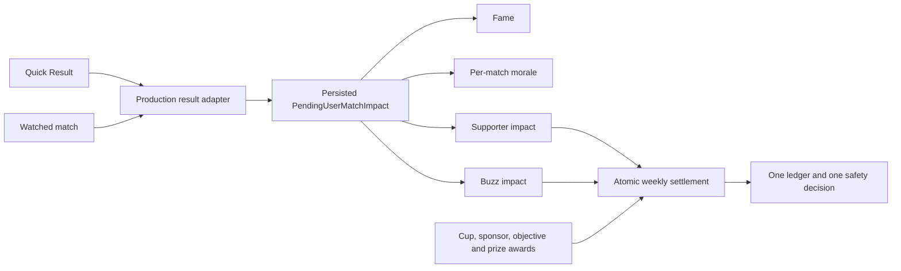

# Club Business, Supporters, and Buzz Implementation Plan

**Date:** 2026-08-04  
**Status:** historical; Buzz was removed on 2026-08-20
**Type:** feature plus prerequisite integrity fixes  
**Source design:**
[`docs/superpowers/specs/2026-08-04-club-business-and-buzz-design.md`](../specs/2026-08-04-club-business-and-buzz-design.md)

## Goal

Ship one trustworthy club-growth arc:

- wins and heroes grow the supporter base, with slow decline after sustained
  losing;
- reaching D4 unlocks one to three managed sponsor slots with objectives and
  monthly payments;
- Season 3 unlocks Buzz from goals, wins, and hero moments, paid twice per
  season;
- schema-3 careers keep their existing sponsor income; and
- additional income is balanced by higher Level-2 and Level-3 facility upgrade
  prices without making existing facility traps more expensive.

The work is deliberately foundation-first. Sponsor cards are not started until
settlement ordering, real match participants, Quick/Watch parity, and facility
cost basis are correct.

## Non-negotiable order

1. Weekly awards enter settlement before financial safety.
2. The complete schema-4 contract lands before the first new persistent writer.
3. One production match adapter persists actual participants and power moments.
4. Quick Result and watched-with-no-input use one owner-approved policy.
5. Facility basis and current facility lies/traps are fixed before prices rise.
6. Sponsor lifecycle and season transition land before audience rewards.
7. Supporters and Buzz consume the shared match impacts.
8. Migration evidence is rerun after every new writer is connected.
9. New Finances UI meets phone-width and accessibility contracts.
10. Accounting and end-to-end balance cohorts approve the numbers.

If scope must shrink, cut sponsor brand count or objective-family variety first.
Never cut atomic settlement, the schema contract, match-impact/parity work,
facility basis, or final migration revalidation; those are integrity work, not
optional polish.

Task 1 is an independently shippable Cup/safety fix. Task 1A establishes the
complete schema-4 shape, codec, migration, and reconciliation **before** any
later task may write a new field. It must be in the same atomic integration as
the first persistent writer. A build must never serialize `clubBusiness`,
`capitalInvested`, sponsor rules, or Buzz state while stamping schema 3.

## Architecture



The production result adapter is the only path from a simulated user match to
career rewards. Thin synthetic results remain explicit test inputs and never
come from the app.

## Task 0 — Lock Quick/Watch policy

**Owner decision: B confirmed 2026-08-05.** Quick treats the user as the controlled side with no
  tactical inputs, while using the same persisted Auto Subs choice and
  emergency-substitution behavior as watched play. The opponent stays
  auto-coached.

B preserves the existing player-facing Auto Subs choice and avoids automatic
engine decisions racing the manager's recorded inputs. It should construct new
Quick replays from existing controlled-team options and recorded substitutions,
which changes future Quick outcomes without changing old replay meaning.

**Files to inspect/modify after the choice:**

- `src/game/matchday.ts`
- `src/application/store.ts`
- `App.tsx`
- `src/render/MatchScreen.tsx`
- `src/render/match-control.ts`
- `src/sim/auto-coaching.ts`
- `src/sim/match.ts`
- `src/sim/__tests__/auto-coaching.test.ts`
- `src/sim/__tests__/parity-replay.test.ts`

**Exit gate:**

- [x] Owner selected B.
- [x] The choice is written into the source design and this plan.
- [x] Replay/version implications are accepted before a match-engine edit.

## Task 1 — Make weekly awards atomic

### Purpose

Fix the current Cup path that settles loans/forced sales and only afterward
edits the already-written ledger with prize money. Sponsors and Buzz must not be
built on that write order.

### Files

- Modify `src/game/career.ts`.
- Modify `src/game/types.ts` for `WeeklySettlementAwards` and optional ledger
  `idempotencyKey`.
- Modify `src/persistence/game-state-codec.ts` to preserve optional keys on new
  and legacy ledger lines.
- Create `src/game/weekly-settlement-awards.ts` for pure award construction and
  deduplication.
- Test in `src/game/__tests__/career.test.ts`,
  `src/game/__tests__/cup-match-flow.test.ts`, and a focused new
  `src/game/__tests__/weekly-settlement-awards.test.ts`.
- Extend Cup coverage in `src/application/__tests__/cup-match-flow.test.ts`.

### Steps

- [ ] Write a failing case where a Cup prize prevents a forced sale or rescue.
- [ ] Add `WeeklySettlementAwards`, containing Cup cash/fans and other explicit
  once-only awards due in the settling week.
- [ ] Thread it through `settleCurrentWeek` rather than mutating the result later.
- [ ] Remove post-settlement `awardNationalCupPrize` ledger/cash mutation from
  both `completeNationalCupMatchday` and `advanceM2WeeklySidecars` paths.
- [ ] Append all due cash lines before the single `resolveFinancialSafety` call.
- [ ] Add stable namespaces for Cup round, league prize, recruitment fund,
  sponsor month, objective bonus, and Buzz half.
- [ ] Treat an identical duplicate key as an idempotent no-op and throw when
  the same key arrives with a different payload.
- [ ] Move automatic Cup progression ahead of settlement; weekly sidecars may
  not append money or mutate the newest ledger.
- [ ] Apply Cup fan awards in the final supporter update, not before attendance.

### Exit gate

- [ ] No code path edits a settled ledger afterward.
- [ ] User and NPC-resolved Cup paths produce the same once-only award behavior.
- [ ] Retry before and after save/load is cash- and ledger-identical.

## Task 1A — Establish the complete schema-4 contract

### Purpose

Make every later state write safe. This is not a placeholder migration: it
defines and validates the final Club Business shape, upgrades canonical
schema-3 saves, restores authored rules during application reconciliation, and
updates every existing facility constructor that must satisfy the new basis
invariant. No Task 2–7 writer may land ahead of it.

### Files

- Modify `src/game/types.ts` for `GAME_SCHEMA_VERSION = 4`, final
  `ClubBusinessState`, pending impacts, sponsor snapshots, and Buzz summaries.
- Modify `src/game/facilities.ts` for required `capitalInvested` and current
  build/upgrade write timing; prices remain unchanged until Task 4.
- Create `content/sponsors.json` and add its final validation/loading contract in
  `src/content/schemas.ts` and `src/content/load.ts`.
- Add the migration/reconciliation subset of `src/game/sponsors.ts`.
- Modify `src/persistence/game-state-codec.ts` with strict final schemas and one
  explicit 3→4 rung.
- Modify `src/application/launch.ts` to restore missing Sponsor and Player
  Requests rules without overwriting existing state.
- Extend `src/persistence/__tests__/game-state-migrations.test.ts` and
  `src/persistence/__tests__/facility-game-state-codec.test.ts`.
- Extend `src/application/__tests__/launch.test.ts` and
  `src/application/__tests__/store.test.ts`.

### Steps

- [ ] Define the complete final v4 sidecar before adding any writer: supporter
  streak/summary, pending impacts, sponsor portfolio/offers/season stamps,
  sponsor rules, Buzz value/period/summary, and facility basis.
- [ ] Add strict codec validation and round trips for every final field.
- [ ] Add a 3→4 rung that uses schema-3 guarantees only and never imports live
  authored content.
- [ ] Preserve the exact stored nominal sponsor scalar. Create continuity terms
  only for a previously unlocked D4+ club, never scalar plus portfolio income.
- [ ] Initialize pending impacts and supporter history without inventing past
  matches; apply the exact Week 15/30 Buzz boundary table without writing cash.
- [ ] Rebuild basis from a frozen schema-3 price table exactly once using
  `(seeded ? 0 : old build) + old completed upgrades + old target upgrade for a
  paid UPGRADE project`; never double-count a paid BUILD project.
- [ ] Update existing build/upgrade constructors immediately so every new v4
  facility carries a valid basis even before Task 4 changes prices.
- [ ] Treat missing `playerRequestRules` as a `reconcileLaunchRoster` change.
  Preserve existing baked rules and request progress; the codec does not invent
  authored content.
- [ ] Reconcile validated sponsor rules outside the codec. Week 1–4 migrated
  careers receive deterministic offers; Week 5+ receives continuity plus an
  expired offer-season stamp. Never overwrite signed terms or regenerate a
  matching stamped season.
- [ ] Add an explicit invariant test: no serializer can emit any new-shape field
  with `schemaVersion: 3`, and a contaminated schema-3 fixture is refused rather
  than destructively remigrated.

### Exit gate

- [ ] Full representative schema-3 and schema-2→3→4 careers migrate and round
  trip; missing/future rungs are refused.
- [ ] The exact next sponsor payment and final cash remain unchanged on Cozy and
  Chairman.
- [ ] Basis fixtures pass: seeded L3 Pitch $20,000; player-built L3 $28,000;
  paid L2 underway $16,000; paid build underway $8,000.
- [ ] A second load reconciliation is byte-identical.
- [ ] No Task 2–7 persistent writer can compile or merge without this task.

## Task 2 — Persist one truthful match impact

### Purpose

Stop using the saved current XI for past appearances, Fame, and morale. A league
leg must retain its own participants even if the lineup rotates before a Cup
leg or the app cold-loads between them.

### Files

- Modify `src/game/types.ts`.
- Modify `src/game/matchday.ts`.
- Modify `src/application/store.ts`.
- Modify `App.tsx` for the league-checkpoint save gate.
- Modify `src/game/career.ts`.
- Modify `src/game/player-wellbeing.ts`.
- Modify `src/persistence/game-state-codec.ts` for strict impact persistence.
- Extend `src/game/__tests__/matchday-contributions.test.ts`.
- Extend `src/application/__tests__/watched-match-contributions.test.ts`.
- Extend `src/game/__tests__/player-wellbeing.test.ts`.
- Add `src/game/__tests__/pending-user-match-impact.test.ts`.

### Contract

`PRODUCTION` results require:

- unique user-club `participantPlayerIds`, ordered kickoff XI then substitutes
  by first entry;
- unique `powerFiredPlayerIds`, all contained in participants;
- validated scorer/contribution IDs; and
- enough match facts to snapshot outcome, goals, competition, division scale,
  hero status, supporter components, and Buzz components at completion.

`SYNTHETIC` is an explicit test/harness source. The app may never emit it.
Neutral rival fixtures may retain the existing thin `FixtureResult`; only a
user production fixture is required to carry the expanded contract.

Power ownership is event-time ownership. Seed slot owners from the kickoff XI,
walk events in order, credit `POWER_FIRED` to the current owner, and update the
owner only after appending an incoming substitute. Reading the final player
array would miscredit a hero who fired before being substituted.

### Steps

- [ ] Write failing tests for a scoring substitute receiving goal but not
  appearance/result Fame, and for a rotated Cup XI contaminating league morale.
- [ ] Create one pure adapter from `MatchState` plus fixture context to the
  production result contract.
- [ ] Use it in both Quick and watched completion paths; delete the watched
  path's thinner manual reconstruction.
- [ ] Persist `PendingUserMatchImpact` immediately when each user match ends.
- [ ] Require the intermediate league-leg career save to succeed before a
  waiting Cup match can begin.
- [ ] Gate Cup on the success callback for that exact career checkpoint, not a
  shared `saving` flag.
- [ ] Persist a checkpoint token containing the fixture and exact state. Its
  first failure immediately exposes Retry Save rather than waiting for the
  general three-failure `saveBlocked` threshold. Unrelated/coalesced save
  success cannot clear it; only saving that exact checkpoint releases the Cup.
- [ ] Apply appearance Fame from that match's participants at match completion.
- [ ] Change wellbeing to consume per-fixture participant sets or pending
  impacts, never `state.lineups` for a completed leg.
- [ ] Consume league then Cup exactly once after final settlement.

### Exit gate

- [ ] Cold-load after league, rotate the Cup XI, finish Cup, and prove both
  participant sets, Fame, morale inputs, supporter facts, and Buzz facts survive.
- [ ] Missing production metadata throws at the action boundary rather than
  falling back to the current lineup.
- [ ] Task 1A's schema-4 contract is already active; no impact can be written
  into a save stamped schema 3.

## Task 3 — Enforce real Quick/Watch parity

### Purpose

Replace the false parity test that runs the same Quick configuration twice.

### Steps after Task 0

- [ ] Add a production-path helper that constructs Quick and watched matches
  from the same career fixture, teams, user side, preference, and zero inputs.
- [ ] Apply owner choice A or B without adding unrecorded RNG.
- [ ] Assert identical score, full event stream where promised, substitutions,
  final participants, power-fired IDs, condition, and audience impact.
- [ ] Cover home/away, Auto Subs on/off if B is chosen, benches/no benches,
  red-energy emergencies, and league/Cup fixtures.
- [ ] Prove existing replay envelopes remain byte-identical. No engine bump is
  needed if only new Quick envelopes use existing `controlledTeam`, formation,
  and recorded-substitution contracts.
- [ ] If implementation changes `automaticTeams`, a `MatchOpts` default, RNG
  consumption, or an existing envelope's meaning, bump `ENGINE_VERSION` and
  intentionally regenerate the golden. Never update it without documenting the
  version decision.
- [ ] Update the inaccurate parity test name/comment so it describes what it
  actually executes.

### Exit gate

- [ ] Actual store Quick and watched-no-input paths match over a fixed seed set.
- [ ] Quick and watched produce byte-identical `PendingUserMatchImpact` values.

## Task 4 — Make facility pricing honest and migration-safe

### Files

- Modify `src/game/facilities.ts` for prices, refund use, and direct engine
  guards; Task 1A already owns the required field and write timing.
- Modify `src/game/management.ts`.
- Modify `src/application/view-models.ts`.
- Modify `src/ui/facility-benefit.ts`.
- Modify `src/ui/models.ts` and `src/ui/screens/ClubFinancesScreen.tsx` for
  truthful disabled reasons and staffed-office confirmation.
- Modify `src/application/store.ts`, `App.tsx`, and the existing coach dismissal
  path in `src/game/market-career.ts` for the atomic staffed-office close.
- Extend `src/game/__tests__/facilities.test.ts`.
- Extend `src/game/__tests__/management.test.ts`.
- Extend `src/game/__tests__/facility-weekly-integration.test.ts`.
- Extend `src/application/__tests__/club-finances-transactions.test.ts`.
- Extend `src/persistence/__tests__/facility-game-state-codec.test.ts`.
- Extend `src/ui/__tests__/facility-benefit.test.ts`.

### Steps

- [ ] Preserve Task 1A's nonnegative safe-integer basis invariant: paid
  build/upgrade costs enter immediately, including in-flight work, while
  completion, relocation, upkeep, and use never change it.
- [ ] Refund half the persisted basis on closure.
- [ ] Keep Task 1A's frozen schema-3 table isolated from the newly priced live
  catalog.
- [ ] Change Level-2/3 upgrade prices to the approved table, rounding half up
  to $500. Keep Level-1 builds, upkeep, relocation, and build time unchanged.
- [ ] Use `TRAINING_PITCH_TP_PER_LEVEL` in the visible effect label so it says
  +28 TP per completed level.
- [ ] Set Coaching Office L2/L3 `canUpgrade` false and reject direct engine/store
  attempts, not only hide the next-effect label.
- [ ] For a staffed Coaching Office, show one confirmation with assistant,
  one-week severance, refund, and net. Confirm dismisses and closes atomically;
  cancel changes neither, and the refund may fund severance.
- [ ] Make one pure combined domain transaction the only staffed-office close
  path. The ordinary close rejects while staffed. Allow exact affordability
  when `cash + refund >= severance`; otherwise disable with the exact shortage.
  Success writes separate dismissal and closure one-off lines; failure/cancel
  has zero partial mutation.
- [ ] Give the disabled Coaching Office upgrade a truthful reason instead of
  the screen's generic false `Locked · promotion` fallback.
- [ ] Ensure duplicate maximum-level-only facilities are not described as
  stacking benefits.

### Exit gate

- [ ] Build/upgrade → save/load → complete → close returns the same half-basis.
- [ ] Old facilities cannot gain refund money from the new catalog.
- [ ] Staffed-office tests cover exact affordability, cash below severance but
  cash plus refund sufficient, combined funds insufficient, direct-path guard,
  cancel, separate transaction lines, and zero partial mutation.
- [ ] Task 1A's schema-4 basis migration is already active before a newly priced
  transaction can be serialized.

## Task 5 — Build managed sponsorship and season rollover

### Files

- Extend Task 1A's `content/sponsors.json`, content validation/loading, and
  `src/game/sponsors.ts` with the full product lifecycle and focused tests.
- Modify `src/game/types.ts`, `src/game/career.ts`, and `src/game/full-career.ts`.
- Modify `src/application/launch.ts` and `src/application/store.ts`.

### Steps

- [ ] Validate and bake sponsor rules/catalog into `CareerSetup` and `GameState`.
- [ ] Derive permanent capacity from best division reached: D4/D3/D2 = 1/2/3;
  relegated D5 retains one managed slot.
- [ ] Keep pre-unlock D5 on the single basic scalar path.
- [ ] Create provisional continuity contracts whose nominal sum equals the
  current division anchor and which lock only when Week 5 begins.
- [ ] Generate exactly Steady/Balanced/Bold for each stable slot in Weeks 1–4.
- [ ] Persist offer copy and terms so removed catalog content cannot brick a
  signed contract.
- [ ] Accepting an offer atomically replaces its slot's provisional contract,
  removes sibling candidates, and locks only that slot.
- [ ] On Week 4 settlement, pay the active Week-4 portfolio first; only the
  subsequent Week-4→5 transition locks untouched continuity and removes every
  unresolved candidate.
- [ ] The domain/store accept action requires matching season, Week ≤4, an
  offer still present, and a still-provisional slot. A stale/replayed offer
  throws with zero mutation.
- [ ] Derive objective progress exclusively from persisted league fixtures;
  do not mix mutable counters with fixture-derived progress.
- [ ] Compute difficulty once on the portfolio total and allocate the exact
  result to itemized lines with deterministic largest remainders.
- [ ] Use the same realized-payment helper for ledger, Buzz, forecasts, cards,
  confirmations, and accessibility copy.
- [ ] Implement guarded rollover: expire → division transition → retained
  capacity → scalar anchor → continuity portfolio → offers once → season stamps.

### Exit gate

- [ ] Ignoring offers never blanks or doubles income.
- [ ] D2/D1 Chairman itemized lines equal the legacy aggregate exactly.
- [ ] Partial signing and reload preserve each independent slot.
- [ ] Save/reload immediately before and after Week 4→5 proves payment-first
  ordering, offer expiry, continuity lock, and stale-offer rejection.
- [ ] Objective bonuses settle once on Week 30 and receive the existing
  difficulty percentage.

## Task 6 — Add supporters and Buzz from shared impacts

### Files

- Create `src/game/club-business.ts` or focused `supporters.ts` and `buzz.ts`
  modules; choose the smallest split that keeps formulas isolated.
- Modify `src/game/career.ts` and `src/game/types.ts`.
- Modify post-match and ledger view models for summaries.
- Add focused pure tests plus double-header integration tests.

### Supporter steps

- [ ] Apply the D5→D1 tier scale and hero-appearance component from the
  snapshotted participant impact.
- [ ] Start decline on the third consecutive loss and guarantee a net negative
  result even with four heroes.
- [ ] Reset the loss streak on draw/win; include Cup shootout outcomes.
- [ ] Apply both double-header impacts after all gates/merchandise use pre-week
  supporters and route positive realized gains through `recordFanGain`.

### Buzz steps

- [ ] Unlock at Season 3 independently of D4.
- [ ] Add +5 win, +1 regulation goal, and +2 per distinct power-firing hero.
- [ ] Apply current-week impacts before Week 15/30 payout and reset.
- [ ] Use actual managed portfolio income or the D5 basic scalar, with
  difficulty applied exactly once.
- [ ] Persist period consumption and the last settlement presentation summary.
- [ ] Add idempotent payout lines before financial safety.

### Exit gate

- [ ] Week 15's match contributes to the first-half payout.
- [ ] Season-3 D5 receives Buzz money without managed sponsorship.
- [ ] Reload/retry cannot lose, shift, or duplicate a match impact or payout.

## Task 7 — Revalidate schema 4 after every writer is connected

Task 1A owns the version bump and complete migration before new writes begin.
This task is the final adversarial pass after match impacts, facilities,
sponsors, supporters, and Buzz all mutate that state. It may repair defects, but
it must not become the first place a required migration field is introduced.

### Steps

- [ ] Re-run the full representative schema-3, schema-2→3→4, missing-rung, and
  future-version matrix against the final feature code.
- [ ] Re-run exact next-sponsor-payment equality on Cozy and Chairman before a
  sponsor week; scalar and portfolio can never both pay.
- [ ] Re-run Week 2/4/5/15/16/30/season-end/next-season truth-table cases.
- [ ] Re-run all basis fixtures, including a newly priced build plus L2 at
  $18,000, unchanged on completion and refunded at $9,000.
- [ ] Cold-load a waiting double-header impact through the final codec and prove
  migration/reconciliation does not clear or duplicate it.
- [ ] Remove a sponsor catalog entry and prove the signed snapshot still loads.
- [ ] Reconcile twice and require byte-identical output with no regenerated
  brands, reopened window, overwritten terms, or reset Player Requests.
- [ ] Inspect serialized fixtures and assert every new-shape state is version 4.

### Exit gate

- [ ] No task after Task 1A forced a new migration assumption or silent default.
- [ ] Tasks 1A–7 pass as one persistence unit before any phone/main integration.

## Task 8 — Add Bert handoffs and a 375pt Sponsor Desk

### Files

- Modify `content/assistant-guide.json`.
- Modify `src/game/assistant-guide.ts` and `src/application/assistant-guide.ts`.
- Extend `src/application/__tests__/assistant-guide.test.ts` and
  `src/application/__tests__/management-injury-lineup-view-models.test.ts`.
- Modify `src/application/view-models.ts` and `src/ui/models.ts`.
- Modify `src/ui/screens/ClubFinancesScreen.tsx`.
- Complete the shared web/native tab contract in
  `src/ui/components/ScreenTabs.tsx`.
- Extract the private production confirmation sheet from `App.tsx` to
  `src/ui/components/ConfirmationSheet.tsx` so the real modal is testable.
- Modify `App.tsx` for reveal/scroll/focus routing.
- Add `src/ui/dev-harness/entries/club-business.tsx`, its focused tests, and the
  registry entry.

### Steps

- [ ] Queue Sponsor Desk on the first D4 management morning and Buzz on the
  first Season-3 management morning.
- [ ] Hold Buzz until Sponsor Desk was delivered in a prior logical week when
  both unlock together; cover zero through three occupied inbox slots.
- [ ] Migrated Week 5+ uses continuity/next-preseason copy and no impossible
  “review offers” objective.
- [ ] Route dismissal to Club > Finances, reveal and scroll the target section,
  and move accessibility focus to its heading/first action.
- [ ] Render one vertical sponsor card per row and one slot panel at a time.
- [ ] Use real tab semantics, immediate `Review offer` buttons, and a true
  confirmation modal with Cancel/Escape/Android Back safety and focus restore.
- [ ] Give web tabs linked tab/panel IDs, roving focus, Arrow Left/Right, and
  Home/End behavior in addition to selected state.
- [ ] Cancel/Escape/Back returns to the triggering Review button. Confirm
  returns to the replacement active contract or stable slot heading because
  the signed offer unmounts.
- [ ] Show nominal and actual Chairman money everywhere; Buzz estimates use
  actual receipt.
- [ ] Enforce content-length validation, unrestricted safe wrapping, no nested
  Pressables, measured 44pt targets, live signing announcement, contrast, and
  reduced-motion behavior.

### Exit gate

- [ ] All 14 production-screen cases in the source design have screenshots and
  interaction notes at 375pt, supported 1.6 Dynamic Type, Cozy and Chairman.
- [ ] Acceptance does not claim the story/review Text Size preference applies
  to Club Finances unless this task explicitly expands that preference's scope.
- [ ] DOM/AX state proves tabs, modal containment, focus return, announcement,
  and touch-region size; source-string assertions are insufficient.
- [ ] Modal acceptance proves initial heading focus and inert/hidden background
  before testing Cancel/Escape/Back return and Confirm's replacement target.
- [ ] Guide regression tests cover simultaneous ordering, zero through three
  occupied inbox slots, reload persistence, and migrated non-actionable copy.

## Task 9 — Balance and production-path verification

### Files and fixed samples

- Add `src/audit/__tests__/club-business-accounting-probe.test.ts`.
- Add `src/audit/__tests__/club-business-cohort-probe.test.ts`.
- Add `src/audit/__tests__/club-business-facility-pacing-probe.test.ts`.
- Add `src/audit/promotion-survival-summary.ts` and
  `src/audit/__tests__/promotion-survival-aggregate-probe.test.ts`.
- Add `src/game/__tests__/club-business-determinism.test.ts`.
- [x] Extend `src/audit/__tests__/promotion-survival-probe.test.ts` with
  deterministic count/offset controls, a Cozy/Chairman filter, machine-readable
  shard summaries, and exact aggregate-only cohort gates.
- Before changing live economy code, capture
  `src/audit/fixtures/club-business-control-v3.json` from code commit `ea929d8`,
  schema 3, and engine m2.0. This is **not one migrated save**: it contains
  complete frozen per-seed outputs for every policy/cohort/difficulty, plus the
  policy version, input hash, seed window, cash path, intervention, promotion,
  survival, facility timing, and final-state summary needed by the comparisons.
  Validate the fixture schema and refuse mismatched policy/input hashes.

Use at least 300 paired careers **per major cohort and difficulty**. Give each
probe a disjoint deterministic seed window: accounting offset 0, end-to-end
offset 10,000, and facility pacing offset 20,000. Smoke samples may be smaller,
but approval numbers use the full windows.

Long probes are excluded from normal Jest. Required commands are therefore both
the normal suite/typecheck and explicit opt-in probes, for example:

```bash
CLUB_BUSINESS_SEEDS=300 CLUB_BUSINESS_SEED_OFFSET=0 npm run test:probe -- src/audit/__tests__/club-business-accounting-probe.test.ts
CLUB_BUSINESS_SEEDS=300 CLUB_BUSINESS_SEED_OFFSET=10000 npm run test:probe -- src/audit/__tests__/club-business-cohort-probe.test.ts
CLUB_BUSINESS_SEEDS=300 CLUB_BUSINESS_SEED_OFFSET=20000 npm run test:probe -- src/audit/__tests__/club-business-facility-pacing-probe.test.ts
PROMOTION_SURVIVAL_SEEDS=300 PROMOTION_SURVIVAL_WEEKS=30 npm run test:probe -- src/audit/__tests__/promotion-survival-probe.test.ts
```

The corrected promotion cohort can instead run as twelve 50-seed jobs. Use one
fresh summary directory, run offsets `0`, `50`, `100`, `150`, `200`, and `250`
once for each difficulty, then aggregate. A shard validates every career but
deliberately cannot pass or fail the 300-seed survival percentage by itself:

```bash
PROMOTION_SURVIVAL_SUMMARY_DIR=/tmp/hfm-promotion-survival PROMOTION_SURVIVAL_DIFFICULTY=COZY PROMOTION_SURVIVAL_SEEDS=50 PROMOTION_SURVIVAL_SEED_OFFSET=0 PROMOTION_SURVIVAL_WEEKS=30 npm run test:probe -- src/audit/__tests__/promotion-survival-probe.test.ts
PROMOTION_SURVIVAL_SUMMARY_DIR=/tmp/hfm-promotion-survival PROMOTION_SURVIVAL_DIFFICULTY=ALL PROMOTION_SURVIVAL_EXPECTED_SEEDS=300 npm run test:probe -- src/audit/__tests__/promotion-survival-aggregate-probe.test.ts
```

The aggregator rejects missing or extra indices, overlaps, wrong deterministic
seed identities, stale week limits, unexpected difficulties, and unresolved
individual careers before it evaluates signing and survival statistics.

The first 2026-08-05 directional run was invalid as a balance verdict. The
probe manufactured every D5 win, built no Training Pitch, and stopped all
development after D4 Week 4. Its Chairman branch also passed difficulty only
to the career setup; player creation then correctly committed its omitted
difficulty as Cozy, so the two reported modes were Cozy twice. A three-seed
historical reproduction at `ea929d8` was metric-identical to the red current
result, proving Club Business did not cause it. The rail had originally passed
at `96e5d04` because two D4 safety clubs sat at 39/40; it was already red after
the later ladder rebase at `285594f`, before this feature branch.

The corrected probe now earns D5 promotion through real Quick Results, carries
the selected difficulty through player creation, builds/upgrades the Training
Pitch, buys useful drill tiers, and trains a healthy core in every management
week. Both paired D4 paths use that policy; only the prepared path scouts and
attempts affordable transfer upgrades. Scouting completion is the recruitment
gate because “no affordable reported upgrade” is a legitimate resolved window,
not a failed simulation.

The corrected three-seed Week-30 smoke passed on both modes: all 3/3 careers
earned D5 promotion in Season 1, all scouting windows resolved, 2/3 completed a
signing, and all 3/3 survived D4. Cozy finished 1st/1st/2nd; Chairman also
finished 1st/1st/2nd. The full 300-per-mode command is still required before
final tuning approval. The corrected production-path smoke took about 258
seconds for six paired mode/seed cases, projecting the full run to roughly
7.2 hours, so it was not represented as completed interactive evidence.

### Harness A: frozen-outcome accounting

- [ ] Feed the same schedule, squads, complete production impacts, results,
  hero moments, and intended purchase policy to control and feature economies.
- [ ] Report monthly delta, objective bonuses, Buzz, gate/merch gains, facility
  uplift, and first unaffordable purchase separately.
- [ ] Do not use thin `{fixtureId, homeGoals, awayGoals}` synthetics that omit
  hero/participant income.
- [x] Cover D5 through D1 on both difficulties and report contract count,
  completion probability, and realized season value for every profile ×
  objective family.
- [x] Report the exact `$95,500` catalog uplift against a five-division frozen
  accounting envelope, labelled as a proxy rather than continuous-career proof.

The 300-seed offset-0 accounting run on 2026-08-05 kept aggregate profile EV
inside 10% (worst cell 9.7%; shipped Bold `6.50×` remained the smallest passing
global bonus), but the newly required objective-family split failed: 20
division/difficulty/family spreads exceeded 10%, and strict dominance appeared
in D4 Cozy plus D3/D2/D1 Chairman. Therefore the shipped terms are not yet
approved. An audit-only family-aware sensitivity passed all 24 cells with no
dominance on both the canonical window and a disjoint 300-seed offset-40,000
window: Steady wins/goals/finish bonuses `0.25/0.27/0.25×`; Balanced
`0.85/1.00/1.10×`; Bold monthly `0.99×` and bonuses `6.50/6.50/3.10×`.
That first candidate did not generalize to larger independent cohorts. The
robust production contract keeps every value except Bold finish, which is
`2.80×`: two disjoint 3,000-seed cohorts both keep every family spread within
10% (worst `8.672%`) with no strict dominance. Smaller 300-seed windows remain
diagnostics only; both 3,000-seed cohorts are required for approval.

The same two 300-seed windows found that shipped high-division Buzz misses its
rail: D3-D1 median was `88` in both windows, and cap rate was `23.8%` canonical
but `26.2%` held out. The smallest honest sensitivity was win Buzz `+4` instead
of `+5`, leaving goals, hero moments, the 100 cap, and payout formula unchanged.
It produced medians `59` (D5), `71` (D4), and `84` (D3-D1), with worst held-out
cap rate `16.0%`. D5 new-income P25 remained `$3,078/$2,643` on held-out
Cozy/Chairman. A `+6` per-match hero-moment sub-cap also passed, but was rejected
because it would silently contradict the promise that each unique powered
player who fires earns `+2`. Win Buzz `+4` is now the production value.

The same canonical accounting run measured the frozen five-division
sink-to-income ratio at P25/median/P75 `81.6/88.6/106.0%` on Cozy and
`98.0/112.9/128.7%` on Chairman. It sums one independent season in each
division; only the end-to-end cohort can approve real purchase timing and sink
absorption.

### Harness B: end-to-end policy cohorts

- [ ] Allow affordability, training, transfers, and later results to diverge.
- [ ] Report sample size, P25/median/P75 cash, interventions, promotion timing,
  D1 survival, objective completion, expected contract value, Buzz median, and
  cap rate.
- [ ] Cover D5 basic-Buzz, first D4, D3/D2 slot growth, D2→D1 promotion, and
  first-D1 survival on Cozy and Chairman.

### Required gates

- [ ] Training Pitch still buys Week 3, completes after Week 4 settlement, and
  is operational from Week 5 on both difficulties.
- [ ] D5 promotion and first-D4 recruitment/survival rails remain green.
- [ ] New income P25 is at least $2,500; facility-sink absorption, profile EV
  ±10%, Buzz 55–85 median, <25% cap rate, slow seven-loss decline, and fail-soft
  intervention rails pass as written in the source design.
- [ ] Normal full Jest passes, and every explicitly listed opt-in probe command
  passes separately; default Jest intentionally excludes `*-probe.test.ts`.
- [ ] `npx tsc --noEmit` passes.
- [ ] Six-season same-seed/actions state is byte-identical.

## Task 10 — Canon, copy, and release evidence

- [ ] Update `docs/06-economy.md` and the README decision log to supersede D5
  managed slots, Fame-gated slots, and sponsor perks.
- [ ] Update handbook/glossary/tips, including the Cup-only fan-growth claim
  and nominal-versus-actual Chairman labels.
- [ ] Verify no new native dependency, signing, or release-build change exists.
- [ ] Run the focused suites after each task, then the full suite and typecheck.
- [ ] Perform final 375pt web QA with audio muted and the preview/server closed.
- [ ] Perform an iPhone-width native smoke if an available local simulator/device
  can be used without an Expo cloud build; shut it down afterward.
- [ ] Record anything not directly exercised as **NOT VERIFIED**.

## Completion definition

The feature is not complete because sponsor cards render or unit tests are
green. It is complete only when:

1. both match buttons create the same approved production facts;
2. all money enters one pre-safety settlement exactly once;
3. schema-3 sponsor income and facility basis are preserved;
4. objective and Buzz economics pass both harnesses;
5. the real Finances screen works at 375pt with truthful money and accessible
   interactions; and
6. canon and player-facing copy describe the shipped behavior exactly.

No commit, push, pull request, deployment, or release is implied by this plan.
Those actions require separate owner authorization.
